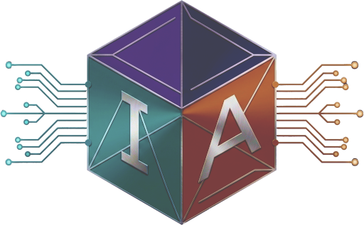

<div align="center">
  
  <br/>
  <br/>

  
  
  
  

  <p style="padding-top: 0.2rem;">
    <b>IAGHI: IA Graphics Hardware Interface</b>
  </p>
</div>

## **Overview**
**IAGHI** is a modern, lightweight, and explicit C++ graphics abstraction layer built over Vulkan. It is designed to significantly reduce the boilerplate required to render modern 3D graphics while maintaining the performance characteristics and explicit control of low-level APIs.

Currently, IAGHI fully supports standard graphics rendering, with compute pipeline support on the roadmap.

## **Features**
- Clean C++ API: Utilizes modern C++ features, strong typing, and Auxid `Result<T>` pattern for robust error handling.
- Simplified Resource Management: Batch creation and destruction of Buffers, Images, and Samplers to minimize driver overhead.
- Streamlined Synchronization: Replaces Vulkan's verbose memory barriers, access flags, and pipeline stages with a simplified `EResourceState` approach.
- Dynamic Descriptor Tables: Easy-to-use binding layouts and descriptor updates for uniforms, storage buffers, and sampled images.
- Modern Rendering: Supports SPIR-V shaders directly.
- Helper functions for automatic mip-map generation and handling block-compressed texture formats.

## **Architecture & Philosophy**

IAGHI provides an opaque handle-based architecture (e.g., `Device`, `Buffer`, `Pipeline`, `CommandBuffer`). It strips away the hundreds of lines of setup code usually required for Vulkan, allowing you to focus on the actual rendering logic.

There are no implicit render passes; the API is designed around modern dynamic rendering paradigms, encapsulated within `begin_frame()` and `end_frame()`.

## **Quick Look**

Here is a conceptual overview of how to interact with the API:

1. Device Initialization
   
```c++
    ghi::InitInfo init_info = {};
    init_info.app_name = "My IAGHI App";
    init_info.validation_enabled = true;
    init_info.surface_width = 1920;
    init_info.surface_height = 1080;
    // ... populate window surface callbacks ...

    auto device = ghi::create_device(init_info).value();
```

2. Resource Creation

```c++
    // Create a buffer
    ghi::Buffer vertex_buffer;
    ghi::BufferDesc vbo_desc = {
        .size_bytes = sizeof(vertices),
        .usage = ghi::EBufferUsage::Vertex,
        .cpu_visible = true,
        .debug_name = "Main VBO"
    };
    ghi::create_buffers(device, 1, &vbo_desc, &vertex_buffer);
    
    // Upload data
    void* mapped = ghi::map_buffer(device, vertex_buffer);
    memcpy(mapped, vertices, sizeof(vertices));
    ghi::unmap_buffer(device, vertex_buffer);
```

3. The Render Loop

```c++
    ghi::set_clear_color(0.1f, 0.1f, 0.1f, 1.0f);

    while (!window_should_close)
    {
        // Acquires the swapchain image and begins recording
        ghi::CommandBuffer cmd = ghi::begin_frame(device);
    
        ghi::cmd_set_viewport(cmd, 0, 0, 1920.0f, 1080.0f);
        ghi::cmd_set_scissor(cmd, 0, 0, 1920, 1080);
        
        ghi::cmd_bind_pipeline(cmd, my_graphics_pipeline);
        
        u64 offset = 0;
        ghi::cmd_bind_vertex_buffers(cmd, 0, 1, &vertex_buffer, &offset);
        ghi::cmd_bind_descriptor_table(cmd, 0, my_graphics_pipeline, my_descriptor_table);
        
        ghi::cmd_draw(cmd, vertex_count, 1, 0, 0);
    
        // Submits the command buffer and presents to the screen
        ghi::end_frame(device);
    }
    
    ghi::wait_idle(device);
```

## **Roadmap**
The graphics core is complete! The next major milestones for IAGHI are:

**Core**
- [ ] Compute Pipelines: Implement create_compute_pipeline.
- [ ] Compute Dispatch: Implement cmd_dispatch for compute shaders.
- [ ] Compute Bindless: Implement bindless compute resources.
- [ ] WebGPU Backend: Implement WebGPU backend for IAGHI.

**Tooling**
- [ ] Pipeline Baker: A tool to generate pipeline layouts and descriptor sets from JSON.

## **Contributing**
Issues and feature requests are very welcome! However, contributions to the core code are not currently being accepted.

## **License**

Copyright (C) 2026 IAS. Licensed under the [Apache License, Version 2.0](http://www.apache.org/licenses/LICENSE-2.0).
